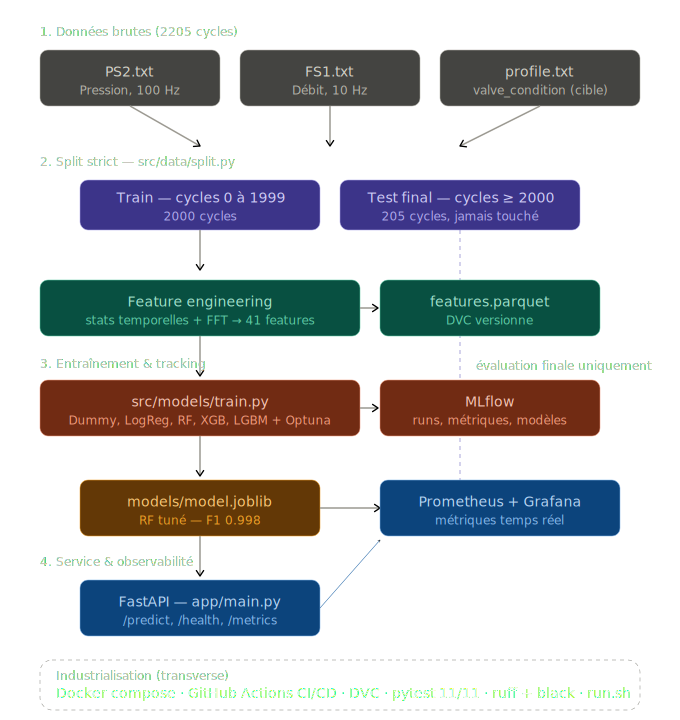

# Maintenance Prédictive — Condition de la valve

Système de maintenance prédictive sur des données de capteurs industriels (UCI Hydraulic Systems).
Prédit si la **condition de la valve** est optimale pour chaque cycle de production, et explique les causes de dégradation via SHAP.

---

## Architecture



---

## Résultats

| Modèle | F1 (CV 5-fold) | ROC-AUC | Accuracy |
|--------|---------------|---------|----------|
| LogisticRegression | 0.9991 | 0.9995 | 0.9990 |
| Random Forest | 0.9986 | 1.0000 | 0.9985 |
| **RF tuné (Optuna)** | **0.9981** | **1.0000** | **0.9980** |
| LightGBM | 0.9967 | 0.9999 | 0.9965 |
| XGBoost | 0.9957 | 1.0000 | 0.9955 |
| Dummy (baseline) | 0.6894 | 0.5000 | 0.5260 |

Modèle déployé : Random Forest tuné via Optuna (`models/model.joblib`)

---

## Données

Source : [UCI — Condition Monitoring of Hydraulic Systems](https://archive.ics.uci.edu/dataset/447/condition+monitoring+of+hydraulic+systems)

| Fichier | Capteur | Fréquence | Points/cycle |
|---------|---------|-----------|--------------|
| `PS2.txt` | Pression (bar) | 100 Hz | 6 000 |
| `FS1.txt` | Débit volumique (L/min) | 10 Hz | 600 |
| `profile.txt` | Labels système | — | 5 colonnes |

- **2 205 cycles** au total
- **Train** : cycles 0–1999 (2 000 cycles)
- **Test final** : cycles 2000–2204 (205 cycles, jamais utilisés pendant l'entraînement)
- **Cible** : `valve_condition == 100` → optimal (1), sinon non-optimal (0)

---

## Lancement rapide

### Prérequis

- Python 3.11+
- Docker + Docker Compose

### Installation locale

```bash
git clone <url-du-repo>
cd maintenance-predictive

# Créer le venv et installer les dépendances
./run.sh install

# Construire les features
./run.sh features

# Entraîner les modèles
./run.sh train

# Lancer les tests
./run.sh test
```

### Stack Docker complète

```bash
./run.sh up
```

| Service | URL |
|---------|-----|
| API FastAPI | http://localhost:8000/docs |
| MLflow UI | http://localhost:5000 |
| Prometheus | http://localhost:9090 |
| Grafana | http://localhost:3000 (admin/admin) |

### Prédire un cycle

```bash
curl -X POST http://localhost:8000/predict \
  -H "Content-Type: application/json" \
  -d '{"cycle_id": 42}'
```

```json
{
  "cycle_id": 42,
  "prediction": 1,
  "probability_optimal": 0.97
}
```

---

## Structure du projet

```
├── data/
│   ├── raw/               # PS2.txt, FS1.txt, profile.txt (DVC)
│   └── processed/         # features.parquet
├── src/
│   ├── data/              # load.py, split.py
│   ├── features/          # build_features.py — stats + FFT
│   ├── models/            # train.py, predict.py, evaluate.py
│   └── utils/             # config.py
├── app/                   # FastAPI — POST /predict
├── tests/                 # pytest — 11 tests
├── notebooks/
│   ├── 01_exploration.ipynb
│   ├── 02_feature_engineering.ipynb
│   ├── 03_modeling.ipynb
│   └── 04_evaluation.ipynb
├── models/                # model.joblib (MLflow registry)
├── monitoring/            # Prometheus + Grafana
├── .github/workflows/     # CI/CD GitHub Actions
├── docker-compose.yml
├── Dockerfile
└── run.sh                 # Point d'entrée principal
```

---

## Feature engineering

41 features extraites par cycle depuis les deux capteurs :

- **Statistiques temporelles** (×2 capteurs) : mean, std, min, max, median, q25, q75, IQR, skew, kurtosis, RMS, range
- **FFT** : 10 composantes fréquentielles PS2 + 5 FS1 + 2 énergies spectrales

> PS2 (100 Hz) et FS1 (10 Hz) sont agrégés séparément par cycle — jamais concaténés bruts.

---

## Stack technique

| Domaine | Outil |
|---------|-------|
| ML | scikit-learn, XGBoost, LightGBM |
| Hyperopt | Optuna |
| Interprétabilité | SHAP |
| Tracking | MLflow |
| Versioning data | DVC |
| API | FastAPI + uvicorn |
| Monitoring | Prometheus + Grafana |
| Tests | pytest (11/11) + pytest-cov |
| Lint / Format | ruff + black |
| Docker | docker compose |
| CI/CD | GitHub Actions |

---

## Commandes disponibles

```bash
./run.sh help        # liste complète
./run.sh install     # créer .venv + pip install
./run.sh features    # construire les features
./run.sh train       # entraîner les modèles
./run.sh test        # pytest avec couverture
./run.sh lint        # ruff + black
./run.sh notebooks   # exécuter les notebooks 01 à 04
./run.sh up          # démarrer la stack Docker
./run.sh down        # arrêter la stack
./run.sh logs api    # logs du service API
./run.sh rebuild api # reconstruire l'image API
```

---

## Notebooks

| Notebook | Contenu |
|----------|---------|
| `01_exploration` | Distribution des classes, visualisation des cycles, corrélations |
| `02_feature_engineering` | Analyse des 41 features, Mann-Whitney, importance RF |
| `03_modeling` | Comparaison des modèles, Optuna, courbes d'apprentissage |
| `04_evaluation` | Métriques finales, matrice de confusion, ROC, SHAP |

---

## CI/CD

Le pipeline GitHub Actions (`.github/workflows/ci.yml`) exécute à chaque push :
1. `ruff check` — lint
2. `black --check` — format
3. `pytest --cov` — tests unitaires
4. `docker build` — validation de l'image

---

## Points méthodologiques clés

1. **Pas de leakage** : le scaler et tous les `fit()` sont appliqués uniquement sur le train set.
2. **Ordre temporel respecté** : pas de `train_test_split` aléatoire — les 2000 premiers cycles sont toujours le train.
3. **Reproductibilité** : `random_state=42` fixé partout via `src/utils/config.py`.
4. **Fréquences différentes** : PS2 (100 Hz) et FS1 (10 Hz) agrégés par cycle avant toute modélisation.
